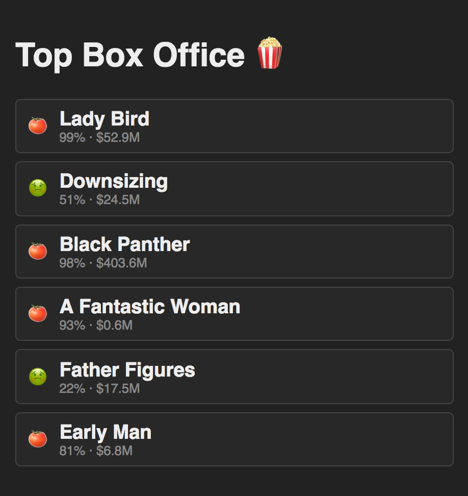
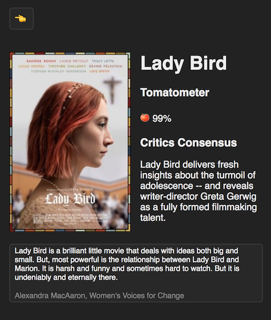

# React Async I/O Testbed

This repo attempts to recreate the starting state of the IO demo from
Dan Abramov's Beyond React 16 talk:

https://reactjs.org/blog/2018/03/01/sneak-peek-beyond-react-16.html

## Example

The latest version of this repo is deployed here:

[https://react-async-io-testbed.netlify.com/](https://react-async-io-testbed.netlify.com/)

## Screenshots

